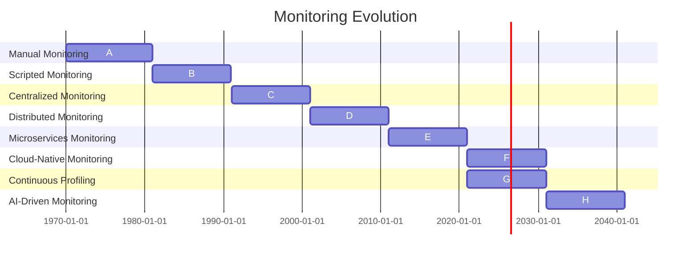

# Evolution & Feasibility


### History of Monitoring in Tech Space

- Monitoring in the tech space has a long history, dating back to the early days of computing. 
- As systems grew in complexity, the need for monitoring and observability increased. 
- Initially, monitoring was a manual process that required human intervention. 
- However, with the development of scripting and automation, monitoring became more efficient and scalable. 
- The evolution of monitoring is illustrated in the timeline below.


### Monitoring Over the Years



---
## OTEL Brief

Open Standard for all MiSvc Telemetry.

- OpenTelemetry is needed for comprehensive **observability** in modern **distributed systems**. 
- It provides a **standardized approach** to capturing **distributed traces** and **metrics**, enabling developers to gain insights into the **performance** and **behavior** of their applications across various **microservices** and **cloud-native environments**. 
- With OpenTelemetry, organizations can achieve **end-to-end visibility**, **troubleshoot issues**, and **optimize the performance** of their applications, ultimately enhancing the overall **user experience**.
- OpenTelemetry is an **open standard** for **observability data**, providing a single set of **APIs**, **libraries**, **agents**, and **instrumentation** for capturing distributed traces and metrics.
- It enables developers to **instrument** their applications in a **vendor-agnostic manner**, allowing them to send **telemetry data** to the **monitoring platform** of their choice.
- OpenTelemetry aims to **unify** the collection of **distributed traces** and **metrics** for all applications, regardless of their **programming language** or **framework**.


### Unique Aspects of OpenTelemetry over APMs

1. **Vendor-Agnostic Approach**: OpenTelemetry provides a vendor-agnostic approach to observability, allowing users to send telemetry data to various monitoring platforms without being tied to a specific vendor.

2. **Standardization**: OpenTelemetry is an open standard for observability data, ensuring consistency and interoperability across different systems and tools.

3. **Community-Driven**: OpenTelemetry is a community-driven project with contributions from various organizations and individuals, ensuring continuous improvement and innovation.

4. **Instrumentation Flexibility**: OpenTelemetry offers flexibility in instrumentation, supporting multiple programming languages and frameworks, making it easier to integrate with diverse applications.

5. **Extensibility**: OpenTelemetry is highly extensible, allowing users to customize and extend its capabilities based on their specific monitoring requirements.


---


## OpenTelemetry SDK Language Support
```shell
  Languages
  ├── JVM Languages
  │   └── Java
  ├── Scripting Languages
  │   ├── Python
  │   ├── JavaScript
  │   ├── Ruby
  │   └── PHP
  ├── Compiled Languages
  │   ├── Go
  │   ├── .NET
  │   ├── C++
  │   └── Rust
  └── Other Languages
      ├── Erlang
      ├── Swift
      └── Objective-C
```
