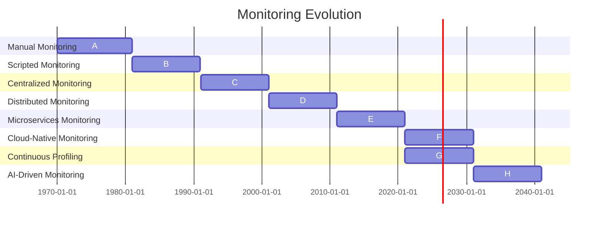

# Evolution & Feasibility

## Evolution

### History of Monitoring in Tech Space

- Monitoring in the tech space has a long history, dating back to the early days of computing. 
- As systems grew in complexity, the need for monitoring and observability increased. 
- Initially, monitoring was a manual process that required human intervention. 
- However, with the development of scripting and automation, monitoring became more efficient and scalable. 
- The evolution of monitoring is illustrated in the timeline below.


### Monitoring Over the Years



---


## OpenTelemetry SDK Language Support
```shell
  Languages
  ├── JVM Languages
  │   └── Java
  ├── Scripting Languages
  │   ├── Python
  │   ├── JavaScript
  │   ├── Ruby
  │   └── PHP
  ├── Compiled Languages
  │   ├── Go
  │   ├── .NET
  │   ├── C++
  │   └── Rust
  └── Other Languages
      ├── Erlang
      ├── Swift
      └── Objective-C
```
