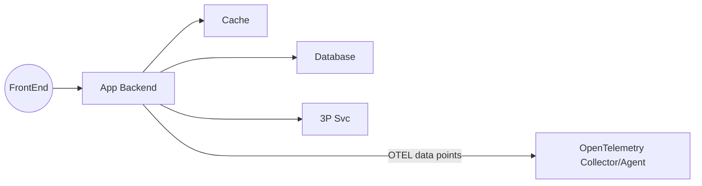

# Architecture 

### OTEL Arch 

---

### Simple App Arch

```mermaid
graph LR
    Fe((FrontEnd)) --> A[App Backend] ---> DB[Database]
    A ---> 3p[3P Svc]
    A --> Redis[Cache]
    A --OTEL data points ------>  otel[OpenTelemetry Collector/Agent]

```

---
###   eBPF -> Cilium Arch

#### Full Cilium Capabilities

